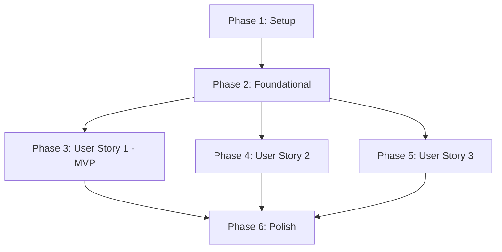

# Tasks: Kindle Book Crawler

**Input**: Design documents from `/specs/001-kindle-book-crawler/`
**Prerequisites**: [plan.md](plan.md), [spec.md](spec.md), [research.md](research.md), [data-model.md](data-model.md), [contracts/](contracts/)

**Tests**: No tests requested in specification. Tasks focus on implementation only.

**Organization**: Tasks are grouped by user story to enable independent implementation and testing of each story.

## Format: `[ID] [P?] [Story] Description`

- **[P]**: Can run in parallel (different files, no dependencies)
- **[Story]**: Which user story this task belongs to (e.g., US1, US2, US3)
- Include exact file paths in descriptions

## Path Conventions

- **Single project**: `src/`, `tests/` at repository root
- Paths follow structure from [plan.md](plan.md)

---

## Phase 1: Setup (Shared Infrastructure)

**Purpose**: Project initialization, Deno configuration, and Playwright setup

- [ ] T001 Create project directory structure: src/, src/config/, src/domain/, src/robots/, src/crawler/, src/output/, src/logging/
- [ ] T002 Initialize deno.json with nodeModulesDir: auto and npm dependencies
- [ ] T003 [P] Install Playwright browser binaries using npx playwright install chromium
- [ ] T004 [P] Create types.ts with TypeScript interfaces from data-model.md

---

## Phase 2: Foundational (Blocking Prerequisites)

**Purpose**: Core infrastructure that MUST be complete before ANY user story can be implemented

**⚠️ CRITICAL**: No user story work can begin until this phase is complete

- [ ] T005 [P] Implement Amazon domain blocklist in src/domain/allowlist.ts
- [ ] T006 [P] Implement URL parsing and domain extraction in src/domain/extractor.ts
- [ ] T007 [P] Implement structured logging with Deno console in src/logging/logger.ts
- [ ] T008 [P] Implement JSON configuration loader and validator in src/config/loader.ts
- [ ] T009 Implement robots.txt fetcher using Deno fetch API in src/robots/fetcher.ts
- [ ] T010 Implement robots.txt parser using npm:robots-parser@3.0.1 in src/robots/parser.ts
- [ ] T011 Implement in-memory robots.txt cache with 24-hour TTL in src/robots/cache.ts

**Checkpoint**: Foundation ready - user story implementation can now begin in parallel

---

## Phase 3: User Story 1 - Crawl Single Website for Free Kindle Books (Priority: P1) 🎯 MVP

**Goal**: Deliver core MVP that validates robots.txt compliance, extracts book data from a single URL using CSS selectors, and outputs structured JSON

**Independent Test**: Provide a config.json with one URL and its selectors, verify robots.txt is checked, and confirm JSON output contains book title, author, source URL, and Amazon link

### Implementation for User Story 1

- [ ] T012 [P] [US1] Implement Playwright browser lifecycle management in src/crawler/browser.ts
- [ ] T013 [P] [US1] Implement page navigation with timeout and error handling in src/crawler/navigator.ts
- [ ] T014 [US1] Implement DOM extraction using CSS selectors from config in src/crawler/scraper.ts (depends on T012, T013)
- [ ] T015 [US1] Implement JSON output formatter for BookPromotion array in src/output/formatter.ts
- [ ] T016 [US1] Implement stdout/file writer using Deno APIs in src/output/writer.ts
- [ ] T017 [US1] Implement main CLI entry point in src/main.ts: load config, check robots.txt, crawl single URL, output JSON
- [ ] T018 [US1] Add validation for required fields (title, amazonProductUrl) and skip incomplete books
- [ ] T019 [US1] Add logging for skipped URLs (robots.txt violations, Amazon domains, HTTP errors)
- [ ] T020 [US1] Test MVP end-to-end with sample config.json containing one valid URL - PASS if: (1) JSON output validates against contracts/output.schema.json, (2) output contains all required fields (title, sourceUrl, amazonProductUrl, crawlTimestamp), (3) log confirms robots.txt was checked

**Checkpoint**: At this point, User Story 1 should be fully functional and testable independently. This is the MVP!

---

## Phase 4: User Story 2 - Crawl Multiple Pages Sequentially (Priority: P2)

**Goal**: Extend MVP to handle batch collection from multiple URLs with per-domain robots.txt checking and configurable delays between requests

**Independent Test**: Provide a config.json with 3-5 URLs from different domains (each with CSS selectors), verify each domain's robots.txt is checked independently, delays are enforced between navigations, and JSON output contains aggregated results from all allowed URLs

### Implementation for User Story 2

- [ ] T021 [US2] Implement sequential URL queue with delay management in src/crawler/queue.ts
- [ ] T022 [US2] Update src/main.ts to process multiple targets from config.targets array sequentially
- [ ] T023 [US2] Add delay enforcement between page navigations (configurable via config.delay, default 2s)
- [ ] T024 [US2] Aggregate BookPromotion results from all successful crawls into single JSON output
- [ ] T025 [US2] Cache robots.txt rules per domain to avoid redundant fetches for same domain
- [ ] T026 [US2] Add summary statistics to output: total URLs, successful, skipped, failed counts
- [ ] T027 [US2] Test batch crawling with config.json containing 5 URLs from 3 different domains - PASS if: (1) JSON output validates against output.schema.json, (2) summary.total equals 5, (3) books array contains results from all successful crawls, (4) logs show robots.txt checked once per domain, (5) execution time confirms delays enforced

**Checkpoint**: At this point, User Stories 1 AND 2 should both work independently. Batch collection is now operational.

---

## Phase 5: User Story 3 - Handle Failures Gracefully (Priority: P3)

**Goal**: Ensure crawler handles network errors, missing data, malformed pages, and timeouts without crashing, logging specific details for each failure

**Independent Test**: Provide a mix of valid URLs, URLs with network issues, and URLs with missing book data, verifying the crawler completes without crashing and produces logs explaining each failure

### Implementation for User Story 3

- [ ] T028 [P] [US3] Add timeout handling for page navigation in src/crawler/navigator.ts (default 30s)
- [ ] T029 [P] [US3] Add HTTP error handling (403, 404, 429, 5xx) in src/crawler/navigator.ts
- [ ] T030 [US3] Add CAPTCHA/bot detection handling in src/crawler/navigator.ts (immediate skip with log)
- [ ] T031 [US3] Add network error handling for robots.txt fetch failures in src/robots/fetcher.ts
- [ ] T032 [US3] Add error array to output JSON with {url, reason} for each skipped/failed URL
- [ ] T033 [US3] Ensure crawler continues processing remaining URLs after any failure (no crash)
- [ ] T034 [US3] Add structured error logging with URL, error type, and reason for each failure
- [ ] T035 [US3] Test failure scenarios: timeouts, missing fields, unreachable robots.txt, HTTP 403 - PASS if: (1) crawler exits with code 0 (no crash), (2) output.errors array contains entries for each failed URL with specific reasons, (3) logs contain structured error messages with URL and error type
- [ ] T036 [US3] Validate crawler completes successfully when 50% of URLs fail - PASS if: (1) crawler exits successfully, (2) summary.successful + summary.skipped + summary.failed equals summary.total, (3) books array contains only successful extractions, (4) output validates against output.schema.json

**Checkpoint**: All user stories should now be independently functional. Crawler is production-ready.

---

## Phase 6: Polish & Cross-Cutting Concerns

**Purpose**: Improvements that affect multiple user stories and final validation

- [ ] T037 [P] Add configuration validation against config.schema.json in src/config/loader.ts
- [ ] T038 [P] Add output validation against output.schema.json in src/output/formatter.ts
- [ ] T039 [P] Update README.md with installation, usage, and configuration instructions
- [ ] T040 [P] Add CLI help text (--help flag) showing usage examples
- [ ] T041 Validate against quickstart.md scenarios: single URL, multi-URL, robots.txt disallow, timeout handling
- [ ] T042 Code cleanup: remove console.log debugging, ensure consistent error messages, validate User-Agent format
- [ ] T043 Performance check: verify 2+ second delays between requests, validate sequential execution (no parallel crawls)
- [ ] T044 Security audit: confirm no Amazon domain navigation, no credential handling, proper permission documentation

---

## Dependencies & Execution Order

### Phase Dependencies



- **Setup (Phase 1)**: No dependencies - can start immediately
- **Foundational (Phase 2)**: Depends on Setup completion - BLOCKS all user stories
- **User Stories (Phase 3-5)**: All depend on Foundational phase completion
  - US1, US2, US3 can proceed in parallel (if staffed)
  - Or sequentially in priority order (P1 → P2 → P3)
- **Polish (Phase 6)**: Depends on all desired user stories being complete

### User Story Dependencies

- **User Story 1 (P1)**: Can start after Foundational (Phase 2) - No dependencies on other stories
- **User Story 2 (P2)**: Can start after Foundational (Phase 2) - Extends US1 but independently testable
- **User Story 3 (P3)**: Can start after Foundational (Phase 2) - Adds error handling across US1/US2 components

### Within Each User Story

**User Story 1 (MVP):**

- T012 (browser.ts) and T013 (navigator.ts) are prerequisites for T014 (scraper.ts)
- T014, T015, T016 can run in parallel after T012/T013 complete
- T017 (main.ts) integrates all components, must be last
- T018-T019 add validation/logging, can run after T017
- T020 is final validation test

**User Story 2:**

- T021 (queue.ts) is independent, can start immediately
- T022-T027 extend main.ts and integrate queue, must run sequentially

**User Story 3:**

- T028-T031 (error handling) can run in parallel
- T032-T034 (error output/logging) must run after error handling
- T035-T036 are validation tests

### Parallel Opportunities

- **Phase 1 Setup**: T003 and T004 can run in parallel
- **Phase 2 Foundational**: T005, T006, T007, T008 can run in parallel (different files)
  - T009, T010, T011 (robots.txt system) must run sequentially
- **User Story 1**: T012 and T013 can run in parallel
- **User Story 3**: T028, T029, T030, T031 can run in parallel (different files)
- **Polish Phase**: T037, T038, T039, T040 can run in parallel

---

## Parallel Example: User Story 1

```bash
# Launch browser and navigator tasks together (different files):
Task: "T012 [P] [US1] Implement Playwright browser lifecycle management in src/crawler/browser.ts"
Task: "T013 [P] [US1] Implement page navigation with timeout and error handling in src/crawler/navigator.ts"

# After T012 and T013 complete, launch these in parallel:
Task: "T014 [US1] Implement DOM extraction using CSS selectors in src/crawler/scraper.ts"
Task: "T015 [US1] Implement JSON output formatter in src/output/formatter.ts"
Task: "T016 [US1] Implement stdout/file writer in src/output/writer.ts"
```

---

## Implementation Strategy

### MVP First (User Story 1 Only)

1. Complete Phase 1: Setup (T001-T004) - ~1 hour
2. Complete Phase 2: Foundational (T005-T011) - ~4 hours (robots.txt system is core)
3. Complete Phase 3: User Story 1 (T012-T020) - ~6 hours
4. **STOP and VALIDATE**: Test single-URL crawling with sample config
5. Deploy/demo MVP if ready

**Total MVP Effort**: ~11 hours (assuming single developer)

### Incremental Delivery

1. **Phase 1+2**: Setup + Foundational → Foundation ready (~5 hours)
2. **Phase 3**: Add User Story 1 → Test independently → Deploy/Demo (**MVP!**) (~6 hours)
3. **Phase 4**: Add User Story 2 → Test independently → Deploy/Demo (batch crawling) (~4 hours)
4. **Phase 5**: Add User Story 3 → Test independently → Deploy/Demo (production-ready) (~6 hours)
5. **Phase 6**: Polish → Final validation (~3 hours)

**Total Full Implementation**: ~24 hours (assuming single developer)

### Parallel Team Strategy

With multiple developers:

1. **Team completes Setup + Foundational together** (~5 hours)
2. Once Foundational is done:
   - **Developer A**: User Story 1 (T012-T020) - MVP ready in ~6 hours
   - **Developer B**: User Story 2 (T021-T027) - Batch feature ready in ~4 hours
   - **Developer C**: User Story 3 (T028-T036) - Error handling ready in ~6 hours
3. Stories complete and integrate independently
4. **Team completes Polish together** (~2 hours)

**Total Parallel Team Effort**: ~13 hours (with 3 developers working in parallel)

---

## Task Summary

- **Total Tasks**: 44
- **Setup Phase**: 4 tasks
- **Foundational Phase**: 7 tasks (CRITICAL BLOCKER)
- **User Story 1 (MVP)**: 9 tasks
- **User Story 2**: 7 tasks
- **User Story 3**: 9 tasks
- **Polish Phase**: 8 tasks

**Parallel Opportunities**: 11 tasks marked [P] can run in parallel within their phase

**Suggested MVP Scope**: Complete Setup + Foundational + User Story 1 only (20 tasks, ~11 hours)

---

## Notes

- **[P] tasks**: Different files, no dependencies - safe to parallelize
- **[Story] label**: Maps task to specific user story for traceability
- **No tests included**: Specification did not explicitly request test tasks
- Each user story is independently completable and testable
- Commit after each task or logical group
- Stop at any checkpoint to validate story independently
- Avoid: same file conflicts, cross-story dependencies that break independence
